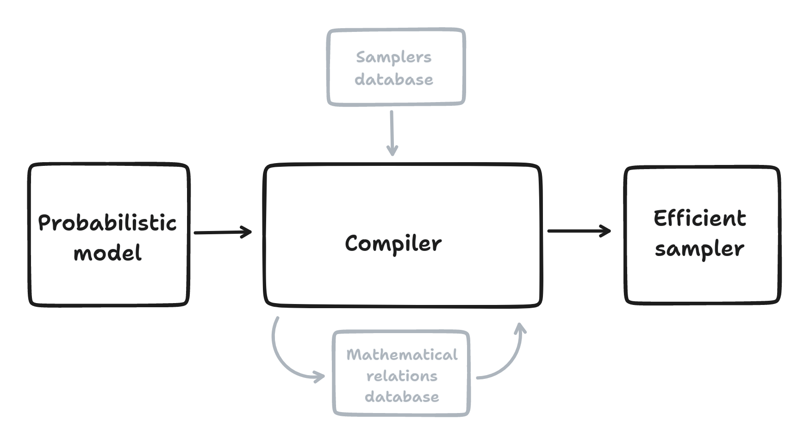

AeMCMC
======

*AeMCMC is a compiler for Bayesian inference.*

AeMCMC is a Python library that automates the construction of samplers for probabilistic models built with  `Aesara <https://github.com/aesara-devs/aesara>`_. AeMCMC analyzes the model graph and possibly rewrites it to find the most suitable samplers.

Features
========

- Automatically identify and compose samplings steps
- Database of mathematical relations
- Database of "exact" posterior sampling steps and general-purpose samplers like NUTS

We aim to provide a **user-friendly interface** similar to what you can find in popular PPLs, but with much **faster and more efficient inference**.

Example
=======

In this example we show that AeMCMC can recognize closed-form posteriors. For instance, the following Beta-Binomial model amounts to sampling from a Beta distribution:

.. tab-set::

   .. tab-item:: Code

    .. code-block:: python

        import aesara
        import aemcmc
        import aesara.tensor as at

        srng = at.random.RandomStream(0)

        p_rv = srng.beta(1., 1.)
        Y_rv = srng.binomial(10, p_rv)

        y_vv = Y_rv.clone()  # observations

        sampler, initial_values = aemcmc.construct_sampler({Y_rv: y_vv}, srng)

        p_posterior_step = sampler.sample_steps[p_rv]
        sample_fn = aesara.function([y_vv], p_posterior_step)

   .. tab-item:: Sampler graph

    AeMCMC has succesfully identified the conjugacy relation, and $p$ is given by a $\operatorname{Beta}$ distribution:

    .. code-block:: python

        aesara.dprint(p_posterior_step)
        # beta_rv{0, (0, 0), floatX, False}.1 [id A]
        #  |RandomGeneratorSharedVariable(<Generator(PCG64) at 0x7F77B2831200>) [id B]
        #  |TensorConstant{[]} [id C]
        #  |TensorConstant{11} [id D]
        #  |Elemwise{add,no_inplace} [id E]
        #  | |TensorConstant{1.0} [id F]
        #  | |y [id G]
        #  |Elemwise{sub,no_inplace} [id H]
        #    |Elemwise{add,no_inplace} [id I]
        #    | |TensorConstant{1.0} [id F]
        #    | |TensorConstant{10} [id J]
        #    |y [id G]

Install AeMCMC
===============

AeMCMC installation can happen in a few different ways. You can install AeMCMC with `conda` or with `pip`. To get the bleeding edge version you can install `aemcmc-nightly.`

.. tab-set::

     .. tab-item:: PyPi

         .. code:: bash

             pip install aemcmc

     .. tab-item:: Conda

         .. code:: bash

            conda install -c conda-forge aemcmc

     .. tab-item:: Nightly

         .. code:: bash

             pip install aemcmc-nightly

.. toctree::
   :hidden:

   get_help
   examples

.. toctree::
   :hidden:
   :caption: Reference

   create_sampler
   sampling_steps
   relations
